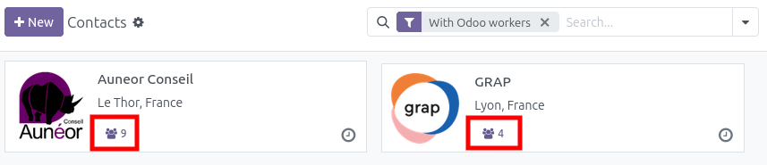

This module contains customization for the Odoo Instance of the OCA France.

## Partners (`res.partner`)

- Adds a field `odoo_worker_qty` to define the number of workers working on Odoo in the
  company. This field is usefull to compute the amount of the association membership
  fee, each year.

