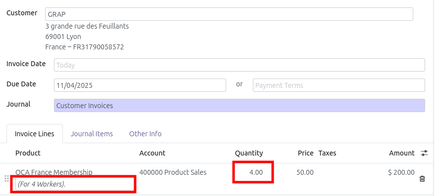

This module contains customization for the Odoo Instance of the OCA France.

## Membership Product (`product.template`)

- Adds a new field `membership_fee_by_odoo_worker`, on product model. If checked, the
  quantity of membership fee invoiced will be equal to the quantity of odoo wokers in
  the company.

